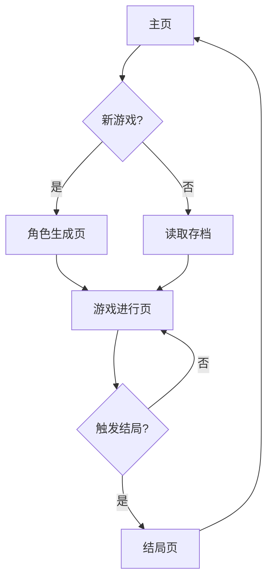

## 1. 产品概述
JX3主题文字RPG/肉鸽游戏，基于剑网3江湖世界观打造的幽默文字冒险游戏。玩家通过随机角色生成、事件选择和属性管理体验江湖人生，追求不同结局。
- 解决玩家碎片化娱乐需求，提供轻松幽默的江湖体验
- 面向喜欢文字游戏、JX3IP和肉鸽玩法的用户群体
- 通过随机性和多结局设计提供重复游玩价值

## 2. 核心功能

### 2.1 用户角色
| 角色类型 | 注册方式 | 核心权限 |
|---------|---------|----------|
| 游客用户 | 无需注册 | 开始游戏、查看成就 |

### 2.2 功能模块
游戏包含以下核心页面：
1. **主页**：游戏入口、新游戏、继续游戏、成就展示
2. **角色生成页**：随机门派/属性生成、角色确认
3. **游戏进行页**：事件展示、选择界面、属性状态
4. **结局页**：结局展示、成就解锁、重新开始

### 2.3 页面详情
| 页面名称 | 模块名称 | 功能描述 |
|---------|---------|----------|
| 主页 | 游戏标题 | 显示JX3江湖文字RPG标题和背景图 |
| 主页 | 开始新游戏 | 清除存档并开始新的游戏流程 |
| 主页 | 继续游戏 | 读取本地存档继续上局游戏 |
| 主页 | 成就系统 | 显示已解锁成就和进度统计 |
| 角色生成页 | 门派随机 | 随机生成五大门派之一（纯阳、万花、七秀、天策、少林） |
| 角色生成页 | 属性生成 | 随机生成初始属性（内力、身法、根骨、机缘、魅力） |
| 角色生成页 | 角色确认 | 显示完整角色信息并开始游戏 |
| 游戏进行页 | 事件展示 | 显示当前遭遇的江湖事件和描述 |
| 游戏进行页 | 选择界面 | 提供2-4个选项供玩家选择 |
| 游戏进行页 | 属性状态 | 实时显示当前角色属性数值 |
| 游戏进行页 | 进度指示 | 显示当前回合数和游戏进度 |
| 结局页 | 结局展示 | 根据最终属性显示对应结局文本 |
| 结局页 | 成就解锁 | 检查并解锁新成就 |
| 结局页 | 重新开始 | 返回主页开始新游戏 |

## 3. 核心流程
玩家操作流程：
1. 访问主页 → 选择开始新游戏或继续游戏
2. 新游戏进入角色生成 → 随机生成门派和属性 → 确认角色
3. 进入游戏循环：遭遇事件 → 阅读描述 → 做出选择 → 属性变化 → 下一事件
4. 达到结局条件 → 展示结局 → 解锁成就 → 返回主页

## 4. 用户界面设计

### 4.1 设计风格
- **主色调**：JX3传统国风配色，深褐(#8B4513)配金色(#DAA520)
- **按钮样式**：圆角矩形，悬停高亮，点击动画效果
- **字体选择**：思源黑体为主，重要标题使用站酷庆科黄油体
- **布局风格**：垂直卡片式布局，居中显示，留白充足
- **图标风格**：简约线条风国风元素图标

### 4.2 页面设计概览
| 页面名称 | 模块名称 | UI元素 |
|---------|---------|----------|
| 主页 | 游戏标题 | 大幅背景图配半透明遮罩，JX3风格毛笔字体标题 |
| 主页 | 功能按钮 | 垂直排列的大按钮组，金色边框配褐色背景 |
| 主页 | 成就展示 | 网格布局的成就徽章，未解锁为灰色 |
| 角色生成页 | 门派展示 | 圆形门派徽章配门派名称和简介 |
| 角色生成页 | 属性面板 | 五边形雷达图展示属性分布 |
| 游戏进行页 | 事件卡片 | 仿古代书信的竖版排版，配相关插图 |
| 游戏进行页 | 选择按钮 | 古风卷轴样式按钮，点击展开详情 |
| 结局页 | 结局文本 | 大幅书法字体结局标题配详细描述 |

### 4.3 响应式设计
- **桌面优先**：默认1920x1080分辨率设计
- **移动端适配**：支持768px以上平板和桌面设备
- **交互优化**：按钮大小适合触摸操作，文字可读性良好

### 4.4 国风场景指导
- **背景氛围**：水墨山水、古典建筑、江湖元素
- **动效设计**：毛笔书写效果、纸张翻页动画
- **音效建议**：古筝、琵琶等传统乐器音效
- **加载动画**：太极图案旋转或毛笔书写进度条